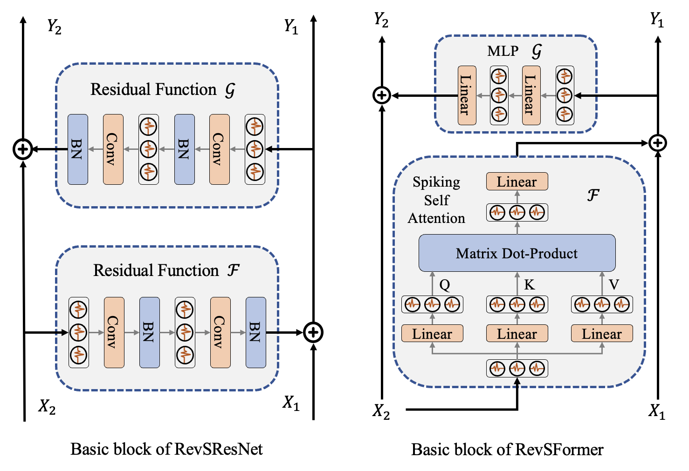

# Memory-Efficient Reversible Spiking Neural Networks
In this paper, we propose the reversible spiking neural network to reduce the memory cost of intermediate activations and membrane potentials during training of SNNs. We first extend the reversible architecture along temporal dimension and propose the reversible spiking block, which can reconstruct the computational graph of forward pass with a reverse process. On this basis, we present the RevSResNet and RevSFormer models, which are the reversible counterparts of the state-of-the-art SNNs.

<div align=center>
</div>


## Main results on CIFAR10/CIFAR100

| Model                | T      |  Param.     | CIFAR10 Top-1 Acc |CIFAR100 Top-1 Acc|
| :---:                | :---:  | :---:       |  :---:    |:---: |
| RevSResNet21  | 4      |  11.05M     | 94.53     |75.46  |
| RevSResNet37  | 4      |  23.59M     | 94.77      |76.34  |
| RevSFormer-2-384  | 4      |  5.76M     | 95.29     |78.04  |
| RevSFormer-4-384  | 4      |  9.32M     | 95.34     |79.04  |

## Main results on CIFAR10-DVS/DVS128

| Model               | T      |  Flops.     |  CIFAR10 DVS Top-1 Acc  | DVS 128 Top-1 Acc|
| :---:               | :---:  | :---:       | :---:                   |:---:            |
| RevSResNet24 | 10     |  0.43G      | 75.50                    | 94.44            |
| RevSResNet24 | 16     |  0.69G      | 76.40                    | 96.53            |
| RevSFormer-2-256 | 10     |  3.78G      | 81.40                    | 97.22            |
| RevSFormer-2-256 | 16     |  6.05G      | 82.20                    | 97.57            |


## Version of important requirements
`timm==0.6.12; cupy==11.3.0; torch==1.10.2+cu113; spikingjelly==0.0.0.0.12;`


## Train
the training codes are put in each dataset folder in file `train.sh`


## Contact
For help or issues using this git, please submit a GitHub issue.

For technical communications, please contact hongzhang99@zju.edu.cn.


## Reference
If you find this repo useful, please consider citing:
```
@article{RevSNN,
  title={Memory-Efficient Reversible Spiking Neural Networks},
  author={Zhang, Hong and Zhang, Yu},
  journal={arXiv preprint arXiv:2312.07922},
  year={2023}
}
```
Our codes are based on PyTorch and SpikingJelly by Wei Fang.
